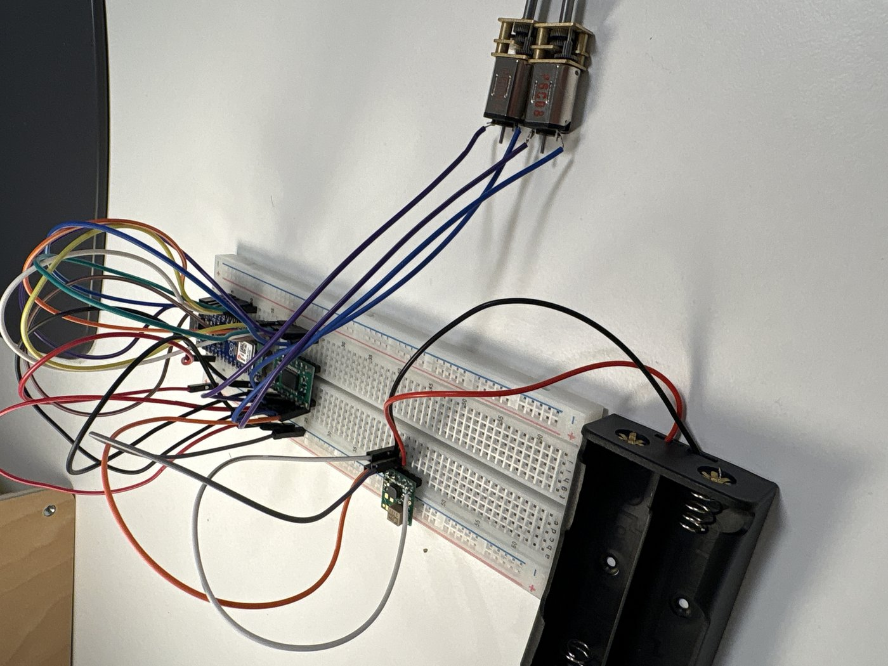

# bb8-droid

Building a BB-8 style ball droid from scratch — a motorized sphere with a
magnetically-held head, driven by an internal two-wheel drive unit, with an
AI voice brain.

This is the hardware side of the project. The droid's voice brain — a fully
local speech pipeline (STT → LLM → TTS) — lives in its own repo:
[local-voice-assistant](https://github.com/Yoavigoda/local-voice-assistant).

![BB-8 wiring]
##Hardware

- **Arduino Nano ESP32** — main controller
- **TB6612FNG** dual H-bridge motor driver
- **2× Pololu micro metal gearmotors** (HP 100:1, 6V) with magnetic encoders
- **2S Li-ion pack** (2× 18650) with a buck-boost converter regulating to 6V
- Breadboard build for now; moving into the sphere chassis next

## Current state

- [x] Motor control firmware: signed-speed drive function for both channels
      over the TB6612FNG (`bb8_motor_control/`)
- [x] Full drivetrain verified end to end: code → driver → converter →
      battery → both motors running timed sequences
- [x] Soldering verified with a pin-scan self-test and multimeter checks
      before every first power-up
- [ ] Encoder feedback and closed-loop speed control
- [ ] Drive unit inside the sphere
- [ ] WiFi control and camera head

## Approach

Every stage gets verified before the next one is trusted: resistance checks
before power, multimeter measurements standing in for motors before real
motors, one subsystem at a time. Slower per step, zero fried components.
